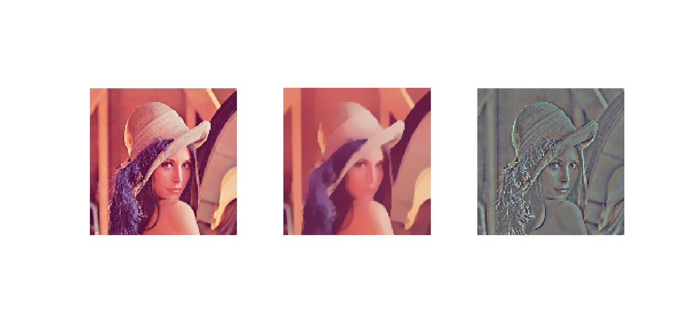
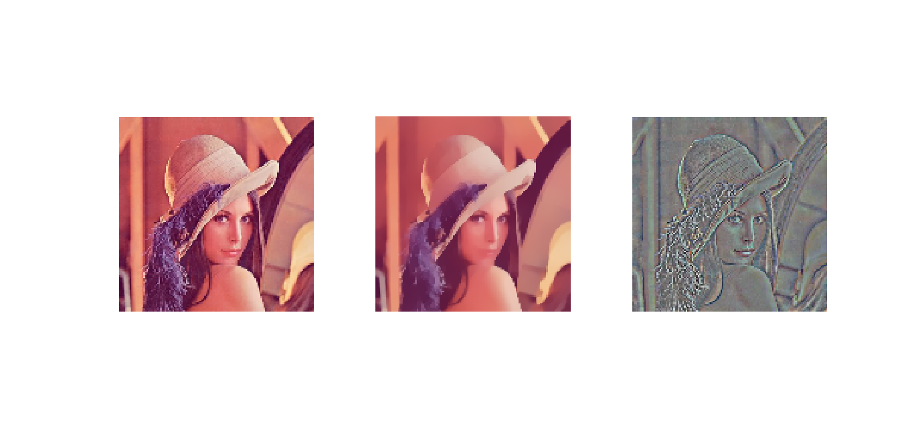
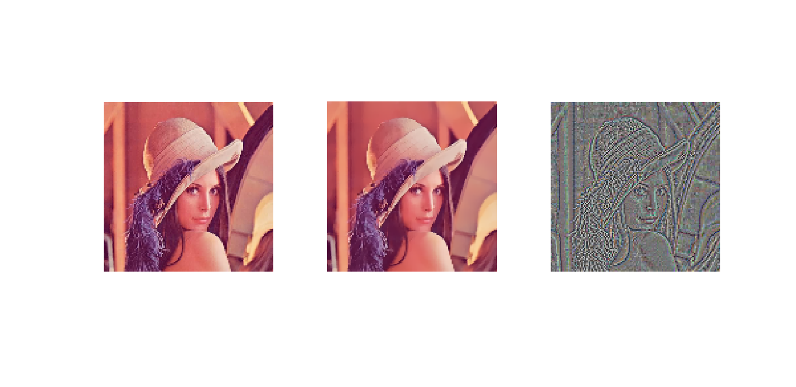

# total_variation
Total Variation on Images, with CG iteration for Poisson solver.

Each test was done with 5 CG iterations for the Poisson equation.

Lambda = 1.

Lambda = 5.

Lambda = 10.

Lambda = 50.

